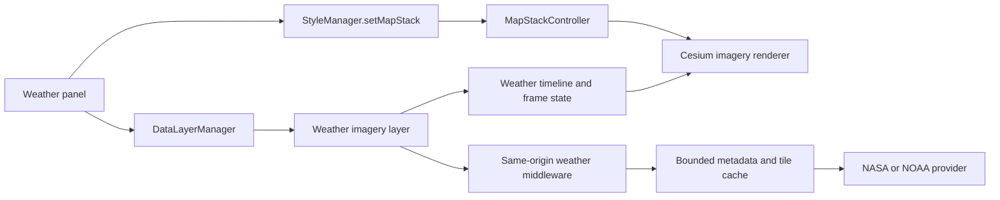

# Live weather imagery: engineering review and implementation plan

Date: 2026-09-04. Reviewed baseline: `55027ac0cfad2159dd9880f82b391a133cabddaf`
on `gasantiago16/OSP-gods-eye-view/main`.

Status: proposed implementation plan. This change adds documentation; satellite
imagery, radar, and playback are not implemented by this commit. The existing
runtime contract remains [CURRENT-STATE.md](CURRENT-STATE.md).

## Engineering opinion

This is a good foundation for a private, exploratory weather console. Keep the
vanilla JavaScript/Cesium architecture and add one bounded feature. The existing
layer manager, render governor, source credits, map switching, and proxy caches
provide useful integration points. A framework rewrite or a raw satellite-data
processing pipeline would add substantial work before delivering visible value.

The first release should be an explicit **Weather Map** experience using the
existing terrain globe: latest satellite imagery, source/time/coverage labels,
and opacity. Add a short animation loop next, then precipitation radar. Google
3D weather compositing is a later rendering investigation.

The review covered startup, map switching, layer lifecycle and persistence,
weather effects and proxies, attribution, repository guidance, and the baseline
test/build surface. It is not an exhaustive security or performance audit.

### Findings that determine the design

| Priority | Evidence in this checkout | Implication and recommendation |
| --- | --- | --- |
| P1: rendering compatibility | [main.js](../src/main.js) hides `viewer.scene.globe`; [MapStackController._activatePhotoreal](../src/mapStackController.js) keeps it hidden. OSM/Bing activate the globe and hide Google tiles. | A normal Cesium imagery layer will not appear in the default Google 3D mode. Ship terrain-globe imagery first. Do not merely set `globe.show = true` alongside Google tiles: startup explicitly documents surface/building clipping. |
| P1: weather provenance | [fetchRegionalWeather](../vite.config.js) calls Open-Meteo's `/v1/forecast`; [regionalBrief.js](../src/data/regionalBrief.js) normalizes numeric conditions. [cockpitCloudEffects.js](../src/cockpitCloudEffects.js) generates a shader from those values. | These are model-derived conditions and procedural clouds, not captured satellite images. Give imagery its own layer, timestamps, and source type. Review the existing `observedAt` naming before reusing it for model data. |
| P2: lifecycle and restoration | [manager.js](../src/data/manager.js) owns asynchronous enable/disable, first update, refresh scheduling, and uncertain outcomes. [layerState.js](../src/data/layerState.js) seals an explicit serialization registry. | Register weather before `finalizeRegistrations`, add its serialization entry in the same change, and use manager-owned visibility. A toggle-only implementation misses cleanup and restoration contracts. |
| P2: rendering and time ownership | [renderGovernor.js](../src/renderGovernor.js) renders on demand without animation holds. [main.js](../src/main.js) suspends the scene when hidden. | Keep weather playback independent of `viewer.clock`, flight interpolation, and satellite propagation. Request frames only on actual changes; suspend weather fetch/prefetch and playback in hidden tabs. |
| P2: concentration of responsibilities | `src/ui.js` is approximately 455 KB and `vite.config.js` 323 KB at this baseline. | Put weather UI, timeline logic, providers, and server middleware in separate modules. Add only small wiring changes to those large files. Extract shared proxy helpers only as required by the new module. |
| P2: integration-test isolation | [track-regression.mjs](../scripts/track-regression.mjs) completed with 97 checks passed and 3 failed; all three failures recorded the same HTTP 503 from `/api/military-installations`. | The baseline browser gate is not green even though the unit suite and build pass. Isolate unrelated live feeds in deterministic weather QA and keep real-provider smoke tests separate. Diagnose the existing proxy failure before a runtime release. |
| P3: documentation drift | [OSP.md](../OSP.md) still has older voice wording, while [SECURITY.md](../SECURITY.md) and current code describe the xAI integration. The README's fork banner used IPv4 despite [AGENTS.md](../AGENTS.md) requiring `localhost` on this machine. | Treat current code and fork guidance as evidence. Correct the banner alongside the plan; schedule the wider upstream/fork documentation reconciliation separately. |

Open-Meteo explicitly describes current conditions as weather model data. Keep
that distinction visible when adding observed imagery. [Open-Meteo documentation](https://open-meteo.com/en/docs)

## Product scope and provider decision

Assumptions: private desktop use, existing localhost server on port 4173,
no new paid account, and Americas-first coverage for Texas, Florida, and
California. These are rollout choices, not a claim of complete global coverage.
OSP physics and `spaceflight_core` remain the authority for OSP truth;
weather display must not modify trajectories or calculate launch clearance.

| Source | Proposed role | Constraints and evidence |
| --- | --- | --- |
| NASA GIBS geostationary imagery | Preferred satellite integration: begin with the `GOES-East_ABI_GeoColor` candidate; evaluate GOES-West and clean infrared as follow-ups. | Standard WMS/WMTS with explicit time dimensions. Read capabilities for the actual layer, tile matrix, format, extent, and available times. Publication delay is separate from frame cadence. [Access basics](https://nasa-gibs.github.io/gibs-api-docs/access-basics/), [product catalog](https://nasa-gibs.github.io/gibs-api-docs/available-visualizations/), [GOES-East candidate listing](https://gibs-a.earthdata.nasa.gov/wmts/epsg3857/best/GOES-East_ABI_GeoColor/) |
| NOAA NESDIS merged GOES GeoColor | Alternative if the GIBS latency/availability spike fails; useful for a latest-image prototype. | `Most_Recent_MERGEDGC` is an **ImageServer**, advertises a ten-minute time extent, and is not a fused tile cache. Validate `exportImage` or an advertised OGC service; do not assume MapServer tile APIs or historical retention. [Service metadata](https://satellitemaps.nesdis.noaa.gov/arcgis/rest/services/Most_Recent_MERGEDGC/ImageServer) |
| NOAA nowCOAST radar | Preferred US radar candidate after satellite MVP. | Discover current GeoServer capabilities and validate a reflectivity product, legend, timestamps, coverage and retention. Old ArcGIS service URLs were retired; an old tutorial is not an endpoint contract. Current service health remains a spike task. [NOAA migration notice](https://www.weather.gov/media/notification/pdf_2023_24/scn23-12_nowcoast.pdf), [nowCOAST](https://nowcoast.noaa.gov/) |
| RainViewer | Optional personal-use radar alternative if NOAA does not satisfy the rollout. | Its transition notice limits public radar to two hours of past frames at ten-minute intervals, zoom 7, Universal Blue, and 100 requests/IP/minute. Satellite IR and nowcast were discontinued January 1, 2026. Some general FAQ wording conflicts with this notice; use the stricter limits and verify the live manifest. [Transition notice](https://www.rainviewer.com/api/transition-faq.html), [terms and attribution](https://www.rainviewer.com/api.html) |
| Open-Meteo | Retain existing cockpit condition summaries and WX effects. | It is not the imagery provider. Keep condition-model valid time and imagery time separate. |

Recommendation: attempt GIBS first and make provider selection a measured gate.
Do not silently replace satellite imagery with a daily composite, radar, model
cloud cover, or procedural clouds during an outage. GeoColor contains surface
imagery as well as clouds; it is not automatically a transparent cloud mask.
Its day/night presentation also differs. Explain this in the product legend.

The provider facts above were checked against primary documentation. No live
weather tile was rendered in the app during this planning change; provider
reachability, coverage, actual latency, and retained frames must still be proved
in phase 0.

## Architecture and code placement



Proposed files are intentionally separate from the current cockpit shader:

| File | Responsibility |
| --- | --- |
| `src/data/weatherImagery.js` (new) | Layer `init/enable/disable/update/destroy/getStats`, normalized feed state, cancellation, and renderer lifetime. No per-pixel entities or detectable-contact records. |
| `src/weather/imageryRenderer.js` (new) | Own Cesium imagery handles, layer order, alpha, tile errors, frame swaps, and destruction. |
| `src/weather/timeline.js` (new) | Pure frame admission, selection, freshness, history/live transitions, and bounded playback. |
| `src/weather/weatherPanel.js` (new) | Source choice, opacity, timestamps, legend, and accessible playback controls. Small attachment in `src/ui.js`. |
| `src/server/weatherImageryProxy.js` (new) | Vite plugin installing the same routes into dev and preview middleware. Inject fetch/cache/clock dependencies for meaningful tests. |
| `src/server/weatherProviders.js` (new) | Fixed provider/product allowlist and provider-specific capabilities/URL conversion. |
| `src/main.js`, `src/data/layerState.js` | Register `weather-imagery` and options before the registry is sealed. Choose an unused token; `w` already belongs to FIRMS. |
| `src/data/dataCredits.js`, `DATA_SOURCES.md` | Source and processing attribution, coverage, permitted use, caching terms, and visible credits. |
| `vite.config.js` | Import/install the weather plugin; reuse bounded proxy helpers without importing the entire Vite config back into the plugin. |

Use the installed lockfile version (Cesium 1.138.0 in this checkout), not merely
the `^1.124.0` lower bound in `package.json`. Cesium provides a WMTS imagery
provider with dimensions, tile bounds, credits and error events. Keep its
configuration provider-specific. [Cesium WMTS reference](https://cesium.com/learn/cesiumjs/ref-doc/WebMapTileServiceImageryProvider.html)

### Map-mode behavior

1. Weather defaults off. The explicit **Open Weather Map** action explains that
   it opens the terrain map, calls the existing public `StyleManager.setMapStack`
   facade, then enables weather through `DataLayerManager.setEnabled`.
2. Keep an already compatible OSM/Bing stack. Otherwise choose OSM so weather
   adds no new key requirement. Retain camera position/orientation and snapshot
   the prior stack; require a successful, current switch before claiming success.
3. An ordinary visibility toggle, restored state, or voice/tool call must not
   silently switch the basemap. If it requests weather over Google 3D, show
   `TERRAIN MAP REQUIRED` with the explicit Weather Map action. Do not report
   imagery as visible while the globe is hidden.
4. Listen to `gev:map-stack-changed`. Suspend imagery requests/rendering on an
   incompatible stack. Respect the controller's switch generation so a late
   completion cannot undo a newer user choice.
5. Closing weather destroys its imagery handles and stops playback. Restore the
   previous stack only if weather still owns the switch; preserve any newer
   manual, shared, or voice map choice. A failed entry rolls back only its own
   mutations and reports the failed stage.
6. In phase 1, cockpit entry suspends weather-map imagery. Existing cockpit WX
   remains independent. Test entry/exit while tracking without changing camera
   ownership or the existing model-derived cloud behavior.

MapStackController continues to own the base imagery at index 0. The weather
renderer owns only its overlay handles and must not call `imageryLayers.removeAll`.
True draping/compositing over Google 3D requires a separate prototype and explicit
visual/performance acceptance; raising imagery onto an arbitrary cloud shell is
not a geographically accurate substitute.

### Feed and time contract

Normalize provider output into a small, versioned catalog:

```text
productId, providerId, kind: satellite | radar
coverage, format, tilingScheme, maxZoom, nominalCadenceSeconds, attribution
retrievedAt, catalogStatus: ready | stale | unavailable
frames[]: id, validTime, timeMeaning, optional scanStart/scanEnd, tileTemplate
```

`validTime` is an ISO UTC instant with a documented meaning, such as scan time
or composite-generation time. `retrievedAt` is when this app obtained metadata.
RainViewer composite time, for example, is not every contributing radar's scan
time. Preserve that distinction rather than renaming every field `observedAt`.
[RainViewer frame semantics](https://www.rainviewer.com/api/weather-maps-api.html)

Admit only bounded, validated records for allowlisted products. Sort and
deduplicate advertised frames; reject invalid or implausibly future timestamps.
Keep the newest accepted catalog from being overwritten by an older request.
Use capabilities/DescribeDomains to select advertised timestamps, never
`Date.now()` rounded into an assumed tile path. Sparse intervals and gaps must
remain visible. The GIBS time dimension requires full timestamps for subdaily
products. [GIBS time rules](https://nasa-gibs.github.io/gibs-api-docs/access-basics/#time-dimension)

Show both frame time and age. `LATEST` means newest available, not zero latency.
`HISTORY`, `STALE`, `NO COVERAGE`, `LOADING`, `PARTIAL`, and `UNAVAILABLE` must
remain distinguishable. Empty/transparent tiles alone do not prove clear weather.
Track latest-feed freshness separately from a deliberately selected history frame.
Agree a product-specific stale threshold after measuring provider publication
delay; metadata fetch success must never refresh the image's age.

Playback uses a weather-owned frame index/clock. **Do not change `viewer.clock`**:
rewinding weather must not rewind flights, satellites or OSP replay. Label the
weather time beside current-time tracks. Start paused; Latest follows subsequent
accepted frames. User scrubbing exits Latest until explicitly reselected.
Persist enabled/product/opacity choices, not autoplay or an expiring frame URL.
Existing share links retain their historical defaults; absent weather means off.

### Delivery, caching, and performance

Use same-origin routes for normalized metadata and bounded image tiles. The
server constructs upstream requests from known product IDs, advertised frame
IDs, and validated tile coordinates. Never accept a client-supplied upstream
URL. Avoid raw NetCDF/GRIB ingestion, reprojection jobs, and permanent archives
in this first release.

Proposed GET routes are `/api/weather-imagery/catalog?product=<known-id>` and
`/api/weather-imagery/tiles/<product>/<frame>/<z>/<x>/<y>.<format>`.
The catalog emits only same-origin tile templates. The tile route maps the
validated coordinates into the selected provider's actual matrix and rejects
unadvertised frames, formats, zooms and out-of-range coordinates. A catalog
outage returns a labeled last-good response within a bounded stale window, or
503 with no usable cache; a tile failure remains an error, never a fabricated
transparent image.

Initial budgets below are proposed tuning limits, not measured performance:

| Resource | Starting limit |
| --- | --- |
| Catalog polling | Once per 60 seconds while enabled/visible; coalesce concurrent misses. Provider frame cadence still governs actual image changes. |
| Metadata and tile fetch | 8-second abort; capabilities at most 8 MiB, normalized catalog at most 1 MiB, individual tiles at most 1 MiB. Verify selected products fit during the spike. |
| Upstream tile work | At most 6 concurrent requests per provider; bounded queue of 32. Return retryable backpressure and honor `Retry-After` with jittered backoff. Apply any stricter provider quota. |
| Server tile cache | LRU bounded by both 128 entries and 64 MiB. Key by product, frame, style, projection and tile coordinate. Follow provider caching terms; never cache errors as valid images. |
| Timeline | At most 12 advertised frames in a rolling two-hour window, fewer if the provider supplies less. No invented intermediate observations. |
| Client imagery | One selected product; at most current and incoming frame layers during a transition. Release retired layers/provider references and abort stale work. |
| Playback | Up to 2 frame changes/second, slower if loading demands it; bounded prefetch of only the next frame. No permanent continuous-render hold for a paused image. |
| Hidden/off/incompatible map | No new weather network work or playback; ignore late callbacks. Revalidate once on return, without a catch-up burst. |

A successful metadata response does not prove that imagery loaded. Keep the old
valid frame until the incoming viewport is usable, or explicitly show a partial
transition; never label old tiles with a new timestamp. Validate how readiness
is detected with Cesium's actual tile lifecycle in phase 0. A viewport change
must not allow the pending layer to wait forever for obsolete tiles.

Default opacity target is 0.65, adjusted after visual QA. Keep source colors and
their legend consistent under CRT/NVG/FLIR presets; either use a normal-color
weather presentation with clear UI or validate a separate compositing path.
Do not show a scientific color legend beside shader-altered imagery as if its
colors still encode the original quantities.

## Implementation milestones

Estimates are engineering-day ranges for one developer familiar with this code;
provider outages and an eventual Google 3D compositor are excluded.

| Phase | Work and dependencies | Exit criteria | Estimate |
| --- | --- | --- | --- |
| 0: provider/rendering spike | Read GIBS capabilities, render a current GeoColor tile on the terrain globe, sample available times and image age at Boca Chica, KSC and Vandenberg. Check bounds, day/night treatment, no-data, alpha, format, caching rights, native zoom and shader behavior. Evaluate NOAA alternative only if needed. | Record exact product/service configuration, actual source timestamps, sample HTTP responses and settled screenshots; prove freshness and frame readiness. Choose provider or record a specific unmet requirement. | 0.5–1 day |
| 1: latest imagery MVP | New layer, middleware, renderer and panel; registry, map-mode transaction, lifecycle cleanup, Latest timestamp and source credits. Depends on phase 0. | Real image visible in compatible maps; failure/coverage states truthful; no startup request when off; toggling/map changes preserve user intent and existing tracks. | 2–3 days |
| 2: history and playback | Frame admission, scrubber, play/pause/Latest, two-layer transition and bounded prefetch. Depends on phase 1 and verified provider history. | Loop only available frames, keep timestamps attached to displayed imagery, leave global clock untouched, and release all weather work on disable/hide. | 1–2 days |
| 3: precipitation radar | Validate current NOAA nowCOAST product, add its adapter/coverage/legend; retain satellite and radar as selectable products, not an unbounded stack. RainViewer is a separately verified alternative. | Radar/clear/no-coverage are distinguishable, provider quota respected, and product switches cancel obsolete requests. | 1–2 days |
| 4: release verification | Run unit/build/tracking plus weather and map-stack QA; document runtime behavior and source terms. | Acceptance matrix below passes; default-off rollback verified; changes reviewable in small commits. | 0.5–1 day |

Expected total: **5–9 engineering days** through the initial radar release.
The useful satellite MVP is available after phases 0–1.

Each implementation phase should be its own reviewable change. Update
`docs/CURRENT-STATE.md` and `CHANGELOG.md` when behavior lands; update
`DATA_SOURCES.md` and credits when a source becomes active. Keep the existing
local server architecture; a static `dist/` upload alone does not host these
middleware routes. Public/multi-user hosting would require a separate deployment
design and provider-capacity review.

## Acceptance and verification

Tests should verify behavior and race conditions, using provider fixtures and
an injectable clock/fetch. Do not rely on real storms or production feeds in
the deterministic test suite.

| Surface | Required evidence |
| --- | --- |
| Provider normalization | Malformed XML/JSON, oversized responses, timestamp units/UTC, out-of-order/duplicate/future frames, sparse intervals, unknown products, and wrong projection/zoom rejected correctly. XML parsing cannot resolve external entities. |
| Proxy | Fixed upstream allowlist, validated paths/coordinates, no open relay or off-allowlist redirects, bounded cache/queue, cancellation, 429 handling, TTL expiration and last-good fallback. Fresh fetch never relabels old imagery. |
| Lifecycle | Enable → immediate disable, failed first update, rapid product changes, slow older frame completion, destroy/re-enable, hidden-tab return and incompatible map changes leave no orphan layers or request loops. |
| Map integration | OSM, Bing with/without ion, failed/superseded map switch, Google 3D suspension, cockpit entry/exit, and return to a manually selected map. No clipping workaround or camera jump. |
| Timeline | Play/pause/scrub/Latest with missing frames; no stale request wins; expired share state resolves honestly; `viewer.clock` and live tracking remain unchanged. |
| Visual truth | Settled screenshots at all three launch sites, oblique/horizon views and outside coverage; day/night, source colors/legend, no-data edges, opacity, partial loading, credit visibility, keyboard focus and narrow viewport controls. |
| Performance | Compare weather off, one paused frame and playback on the same machine/view/feeds. Off adds no weather requests or animation holds. Repeated enable/disable returns layer/listener counts to baseline; cache bounds hold and heap/GPU usage does not grow monotonically across 20 cycles. |

Run `npm.cmd test`, `npm.cmd run build`, and `npm.cmd run test:track` with the
app on `http://localhost:4173`. For runtime changes also run the existing map
source tray harness with keyed and `--keyless` expectations, plus a new
`scripts/qa-weather-imagery.mjs` fixture-driven harness. Use the existing QA
conventions: unsettled Google tiles are not visual sign-off, and headless
SwiftShader performance is not a claim about real-GPU performance.

### Baseline checks for this planning change

- `npm.cmd test`: passed on Node 24.19.0; 2,601 tests total across the ordinary
  suite and two isolated allocation runs, zero failures or skips.
- `npm.cmd run build`: passed. The existing build reports chunks above 1,500 KB;
  weather should load lazily and avoid adding another large initial payload.
  The first sandboxed attempt failed in esbuild path resolution; the permitted
  rerun outside the sandbox passed.
- `npm.cmd run test:track`: completed with **97 passed, 3 failed, 0 skipped**.
  All failures concerned one HTTP 503 from `/api/military-installations`: the
  tracking console-error check, full-run console-error check, and HTTP-5xx check.
  This is a baseline failure with unchanged runtime code; the underlying cause
  of the proxy's 503 was not diagnosed. The harness's pinned Chrome 145 was not
  installed, so the completed run used installed Chrome 152.0.7977.82 through
  `PUPPETEER_EXECUTABLE_PATH`, outside the sandbox after sandbox network denial.
  This is not a calibrated-browser performance result or an all-green gate.
- Local Markdown links resolve; `git diff --check` passes.
- This commit changes no runtime code and includes no downloaded weather imagery.

## Deferred work

Full global multi-satellite coverage, forecast imagery, alert polygons, seamless
Google 3D compositing, long-term archives, raw-data processing and weather-aware
OSP physics are separate follow-ups. For the first release, make the newest
available imagery usable, accurately placed, and honest about its time and gaps.
